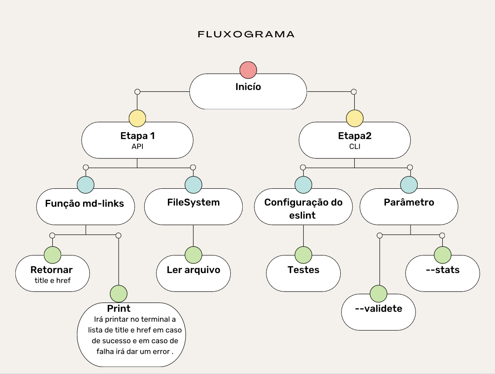

# Markdown Links

### Índice

* [1. Resumo do projeto](#1-resumo-do-projeto)
* [2. Instalação](#2-instalação)
* [3. Guia de uso](#3-guia-de-uso)
* [4. Fluxograma](#4-fluxograma)
* [5. Desenvolvedora](#5-desenvolvedora)

***

### 1. Resumo do projeto

Bem-vindo à Biblioteca de Validação de Links em Arquivos .md! Esta é uma biblioteca Node.js que permite validar os links presentes em arquivos Markdown (.md). Ela verifica a integridade dos links contidos nos arquivos, ajudando a identificar links quebrados ou inválidos.


### 2. Instalação

Para utilizar esta biblioteca em seu projeto Node.js, você precisará tê-lo instalado em seu ambiente. Caso ainda não tenha o Node.js instalado, você pode baixá-lo e instalá-lo a partir do site oficial.

Para instalar o MDLinks, você pode executar o seguinte comando no terminal:

`Terminal`: npm -y <br>
`Terminal`: npm i md-links-nara
- cria um arquivo index.js e importe as funções: 
```js
const { fileRead, 
        validateLinks, 
        statsLinks,
        extractLinks,
        readRecursion 
        } = require('md-links-nara')

``` 
#####Para desinstalar o pacote 
`Terminal`: npm uninstall -g md-links-nara <br>
***

Para utilizar este pacote como uma API, é necessário importar o módulo mdLinks(path, options) usando o método require do CommonJS. Certifique-se de ter instalado o pacote previamente. Este módulo aceita dois argumentos:

path: O caminho para o arquivo .md que você deseja analisar e validar os links.
options: Um objeto opcional que pode conter configurações adicionais para a análise dos links.
É importante observar que esta API utiliza Promises, portanto, você deve utilizar os métodos .then e .catch após a chamada do módulo para lidar com a resolução da promessa pendente.

A API retorna uma Promise pendente, portanto, você deve utilizar .then e .catch para resolver a Promise e tratar os resultados ou erros.


### 3. Guia de uso

### A API (Application Programming Interface)

A API (Interface de Programação de Aplicativos) do MDLinks oferece a capacidade de incorporar as funcionalidades do pacote MDLinks em outros módulos ou projetos por meio de chamadas de funções no código.

A função central da API é denominada fileRead, que requer um argumento representando um caminho para um arquivo ou diretório. Em resposta, ela retorna uma Promessa (Promise) contendo os resultados da busca pelos links. O resultado é uma lista de objetos que contêm informações sobre cada link encontrado. Esses objetos incluem detalhes como o href (URL), o text (texto do link) e o file (caminho do arquivo no qual o link foi localizado).

  `Comando`: mdlinks <./path/to/file.md>

* Se o arquivo não contiver links, ele mostrará o seguinte Error: Esse arquivo não contém links para ler.

* Caso contrário, ele retornará uma lista de links encontrados no arquivo ou diretório especificado, exibindo as informações: href | text | file

### CLI (Command-Line Interface)

O CLI (Command Line Interface) é uma interface de linha de comando que permite aos usuários interagirem com um software ou sistema operacional por meio de comandos de texto inseridos no terminal ou prompt de comando. Em vez de utilizar uma interface gráfica com menus e ícones, os usuários podem executar tarefas, configurar opções e acessar funcionalidades executando comandos específicos.
No contexto de um software ou pacote, como o MDLinks, o CLI oferece uma maneira conveniente para os usuários interagirem com as funcionalidades do pacote sem a necessidade de escrever código. Em vez disso, eles podem utilizar comandos específicos fornecidos pelo CLI para acessar e utilizar as características oferecidas pelo software.


###### -- validate: Opção para verificar se os links são válidos, ou seja, se estão acessíveis ou não. Retorna informações adicionais sobre o status de cada link.

`Comando`:  mdlinks <./path/to/file.md> --validate

* Retorna uma lista de links encontrados no arquivo ou diretório especificado, exibindo as informações: 
   ---   href | text | status | file   ---

###### -- stats: Opção para obter estatísticas dos links encontrados no arquivo. Retorna o total de links e o número de links únicos.

- `Comando`: mdlinks <./path/to/file.md> --stats


* Retorna o total de links e links únicos encontrados no arquivo ou diretório especificado.

###### --validate --stats: Opção para obter estatísticas dos links com a validação dos mesmos. Retorna o total de links, o número de links únicos e o número de links quebrados (não acessíveis).

- `Comando`: mdlinks <./path/to/file.md> --validate --stats

* Retorna o total de links, links únicos e links quebrados (com status de erro) encontrados no arquivo ou diretório especificado.

Lembrando que, para utilizar o CLI do MDLinks, o pacote deve estar instalado globalmente ou como uma dependência de desenvolvimento no projeto.

Essas são as principais funcionalidades e opções disponíveis na API e no CLI do pacote MDLinks, permitindo aos usuários verificar e validar os links em arquivos Markdown de forma fácil e eficiente.


### 4. Fluxograma




### 5. Desenvolvedora

### Nara Branco 
***
